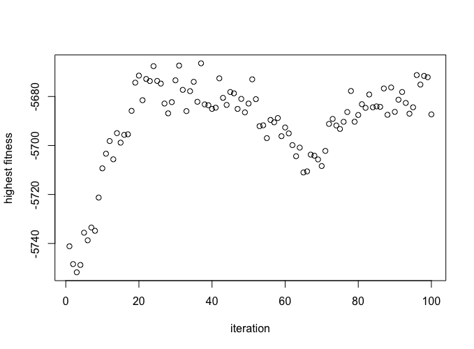
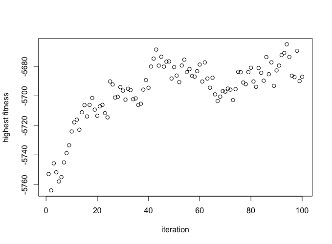

## Project Overview

Our package and results are located in `feichengqi`'s repository.

In creating our genetic algorithm package, we first broke down our main function into the parts described in the Givens and Hoeting literature: selection, crossover, and mutation. For modularity, auxilliary functions were created. For example, we needed a function to initialize the genes of the individuals for the optimization to run on, and we also needed to break up the components in selection. In selection, we need to evaluate the fitness of individuals and then select combinations of these individuals for crossover, so we made a function for fitness separately.

For the selection function, we use common approach to evaluate fitness based on ranks as illustrated in Equation 3.9 of the text and also the score method. We also have a set number of iterations the algorithm runs for. For our crossover and mutation functions, we used the intuitive versions detailed in the text. That is, in crossover, we split the genes of two parents at a random loci and glue the sections from each parent together to get two children of the same length as the parents. We chose to keep both children in our function. For mutation, we simply have a 0.03 chance of each gene in an child to mutate.

## Example Results

We tested our final function on two synthetic datasets: the Madelon dataset from the NIPS 2003 feature selection challenge and a dataset that we created ourselves. The Madelon dataset, which we downloaded from the UCI Machine Learning Repository^[Source: http://archive.ics.uci.edu/ml/datasets/Madelon?ref=datanews.io], is a dataset with a binary response, 500 attributes and 2000 observations. 

According to the data documentation, there are 5 key features and 15 features that are linear combinations of those 5. The remaining features are "probes" that tell us nothing about the data, therefore in testing our function with this dataset, we aim to identify at most 20 features to keep. 

After running the algorithm once, we identified 213 features. This number is much greater than 20, however, we know that we may not be using the most ideal forms of crossover and mutation to get the best performance. Also, with more iterations of the algorithm, we could get better performance. From the plots, we see a clear improvement of our individuals as iterations increases. We see the methods perform quite similarly in this case.

Our synthetic dataset was created with the Madelon dataset in mind. Our 3 key features are sampled from a standard normal distribution, and we created 7 linear combinations of these features. That is, we sampled a random amount of the key features, multiplied the observations by random coefficients generated by a standard normal, and summed them up rowwise. The remaining 10 features are "probes" generated from a normal with 0 mean and 5 variance. Our response variable is a normal distribution with mean a linear combination of the 5 key features and unit variance. At 100 iterations, our function returned 6 important features (5 out of the 10 redundant key features and 1 probe). At 300 iterations, our function returned 3 important features (2 out of the true 3 key features and 1 probe), which is a vast improvement.

## Participation Breakdown

Feicheng Qi was in charge of the main function frame and the testing of the Madelon dataset. He also wrote the main frames of the selection and initialize functions. Cheng Lin created the fitness function and put the package together. Pui-Yee Ling wrote the crossover and mutation functions and a synthetic dataset for testing. Members discussed with each other shortcomings of their functions and did formal testing on their respective parts.